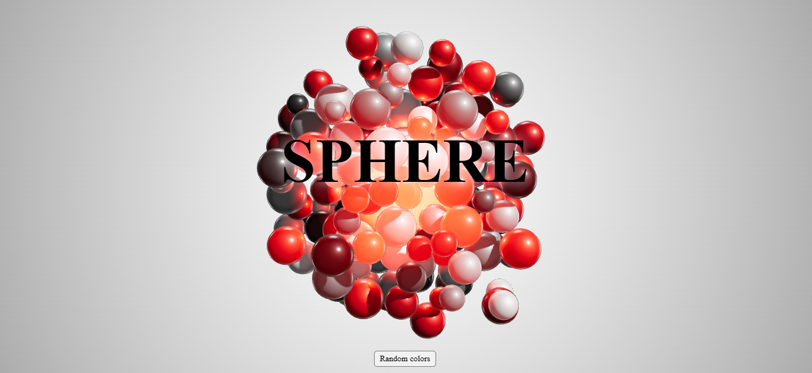
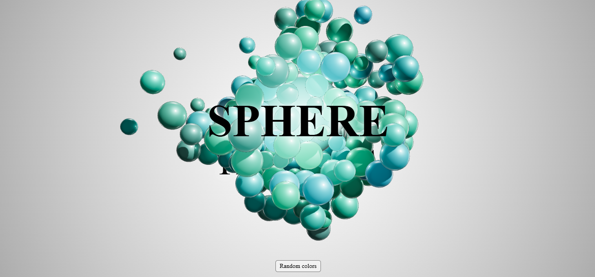
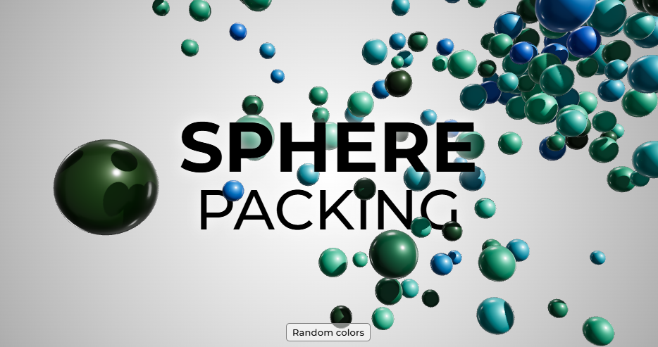
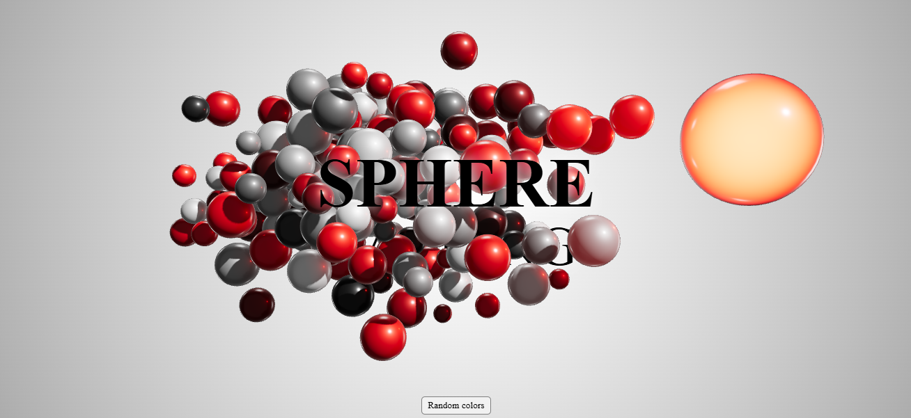
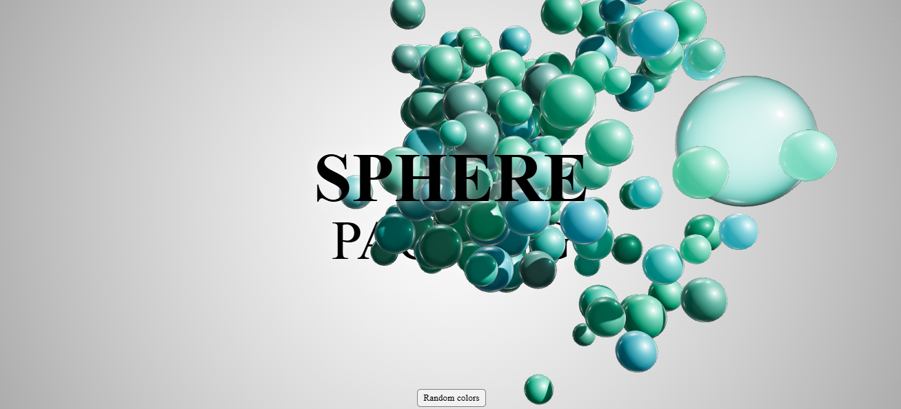

# 🌟 Gravitas3D 🌟

## 🌐 Overview
Welcome to **Gravitas3D** —  an interactive 3D experience that visualizes sphere packing patterns in a dynamic, immersive WebGL environment! This project leverages Three.js, a powerful JavaScript library for 3D rendering, to create an engaging background filled with spheres that can be manipulated in real-time. Explore color changes and pause/resume animations with just a click, offering a captivating visual interaction.

Whether you're a developer looking to learn about 3D graphics or someone wanting to add a unique visual element to your website, Gravitas3D offers a perfect blend of creativity and functionality.


## ✨ Key Features:
- **Interactive Canvas:** A WebGL canvas with a 3D sphere packing background.
- **Color Randomization:** Click the button to randomize the colors of the spheres.
- **Pause/Resume:** Click anywhere outside the button to pause or resume the animation.
- **Responsive Design:** Built to work seamlessly on desktop and mobile devices with a modern UI powered by CSS3 and WebGL.

## 🔧 Built With:
- **Three.js:** The popular library for rendering 3D scenes with WebGL.
- **HTML5:** Markup for creating the web page structure.
- **CSS3:** For styling the page and creating a responsive, visually appealing interface.
- **JavaScript:** Used for dynamic interactions, event handling, and controlling the 3D scene.

<!--## Demo
You can see a live demo of the project on (...). -->

## 🚀 Getting Started

### 🚨 Prerequisites
To run this project locally, you will need:
- A web browser (Google Chrome, Firefox, etc.)
- A text editor (VS Code)
- Make sure to install the Live Server extension in VS Code.

### 💻 Installation

1. Clone the repository:
   ```bash
   git clone https://github.com/ShambhaviSingh16/Gravitas3D.git
   ```
   OR  Download the project files.
2. Open the downloaded files in the VS Code.
3. Right-click your index.html file in VS Code. And Select "Open with Live Server" to see the 3D simulation in action.

## 📸 Preview

### **Initial View:** 
The vibrant sphere packing pattern that fills the screen.
-
-

### **After Color Change:** 
Clicking the "Random colors" button randomizes the sphere colors, creating endless variations.
-
-

### **Pause and Play:** 
Clicking anywhere pauses and resumes the animation, giving you full control over the experience.
-
-
<!---->
